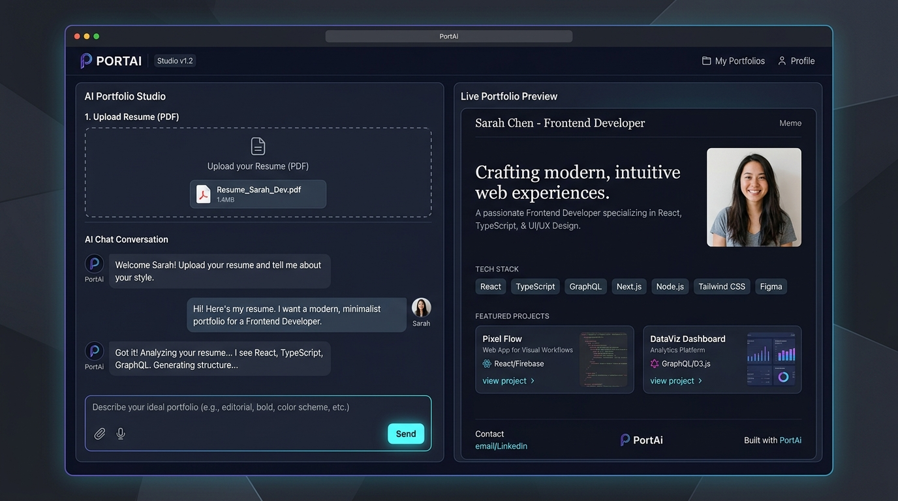

# PortAi

An open-source AI builder that turns your resume PDF or rough notes into a clean, bespoke developer portfolio with instant live preview.



### **[👉 Try the Live Demo](https://nexweb-dot.github.io/PortAI/)**

No sign-up, no credit card, and visitors don't need their own API keys. Just open the link and start building.

---

## Quick Start

You can create and export your portfolio in under a minute:

1. Open the [live demo](https://nexweb-dot.github.io/PortAI/).
2. Drop in your resume PDF (or describe your background in the chat).
3. Say **"generate my portfolio"**, tweak whatever you want, and click **Download HTML**.

---

## Features

- **Resume PDF Parser**: Drop your existing resume and PortAi extracts your name, role, bio, tech stack, and project highlights directly in your browser.
- **Interactive Chat Assistant**: Don't have a resume handy? Just chat with the builder. Tell it your stack, paste a couple of GitHub links, or ask it to adjust the copy.
- **Side-by-Side Live Preview**: Watch your portfolio take shape in real time. Switch between desktop and mobile views right inside the builder.
- **Section-Level Regeneration**: If you want to tweak just your hero headline or project cards, regenerate that specific section without losing the rest of your page.
- **One-Click Static HTML Export**: Download a standalone, responsive HTML file containing all styles and SVGs. You can double-click it to open locally or host it on GitHub Pages, Vercel, or Netlify.
- **Resilient AI Pipeline**: Runs on OpenRouter with automatic provider fallback so generation doesn't drop during peak traffic spikes.

---

## Running Locally

If you want to modify the templates, customize prompts, or run the project on your machine:

### Prerequisites
- Node.js 20 or newer
- An [OpenRouter API key](https://openrouter.ai/keys)

### Setup

```bash
# 1. Clone the repository
git clone https://github.com/NEXWEB-dot/PortAI.git
cd PortAI

# 2. Install dependencies
npm install

# 3. Configure environment variables
cp .env.example .env.local
```

Add your OpenRouter key inside `.env.local`:

```env
NEXT_PUBLIC_OPENROUTER_API_KEY=your_openrouter_api_key_here
NEXT_PUBLIC_OPENROUTER_MODEL=z-ai/glm-5.2:free
```

### Start Development Server

```bash
npm run dev
```

Open [http://localhost:3000](http://localhost:3000) to see the builder.

To test the production static export locally:

```bash
npm run build
npm run preview
```

---

## How It Works & Architecture Decisions

A few deliberate engineering choices behind PortAi:

### 1. 100% Client-Side Architecture (Static Export)
Instead of running a stateful backend server that stores resumes in a database and racks up hosting fees, PortAi is compiled as a static Next.js application (`output: 'export'`). 
- PDF parsing runs entirely on the user's machine using PDF.js WebAssembly workers. Your resume text stays private and never hits a storage bucket.
- AI requests stream directly between your browser and OpenRouter via Server-Sent Events (SSE).

### 2. Multi-Model Failover Routing
Free-tier AI models frequently run into upstream provider rate limits (HTTP 429) or high demand (HTTP 503). To prevent failed generations, PortAi uses an automated fallback chain:
- Primary: `z-ai/glm-5.2:free`
- Fallbacks: `google/gemma-4-26b-a4b-it:free`, `minimax/minimax-m2.7:free`

If the primary provider is busy or throttling requests, the client catches the error and immediately attempts the next model in the pool without interrupting the user.

### 3. Defensive JSON Extraction
Chat LLMs often ignore "JSON-only" system instructions and prepend conversational banter (such as *"I have processed your resume! Here is the JSON:"*), which immediately breaks standard `JSON.parse()`. PortAi uses a multi-tier parser that strips conversational preambles, unwraps markdown code fences, cleans trailing commas, and extracts valid schema objects so generation never crashes on unexpected tokens.

---

## Deploying Your Own Copy

### Deploy to GitHub Pages (Automatic)

1. Fork this repository.
2. Go to **Settings → Secrets and variables → Actions**.
3. Add a secret named `OPENROUTER_API_KEY` with your OpenRouter key.
4. Go to **Settings → Pages → Build and deployment**, and choose **GitHub Actions** as the source.
5. Push to `main`. GitHub Actions will automatically bundle your skills, build the static export, and publish the site.

---

## Acknowledgements & Community

- Built for the [Hack Club Stardance](https://stardance.hackclub.com/) community.
- AI routing powered by [OpenRouter](https://openrouter.ai/).
- Icons by [Lucide](https://lucide.dev/).
- Read the project story and updates in [DEVLOG.md](./DEVLOG.md).
- Questions or feedback? DM `@Shreerang` on Hack Club Slack or ask in `#ask-the-shipwrights`.
